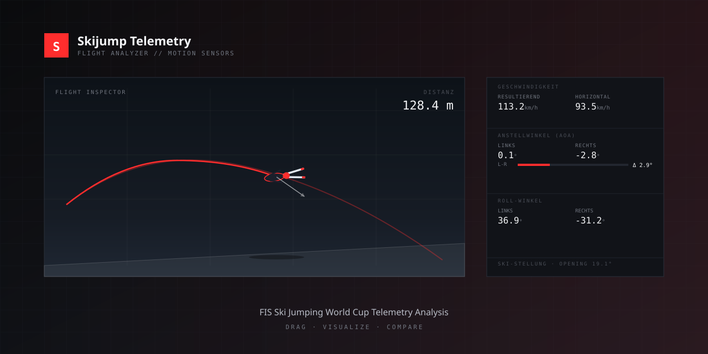

# Skijumping FIS Analyzer

Eine **Streamlit-basierte Analyse-App** für FIS Ski Jumping World Cup
Telemetrie-Daten. Upload einer `.csv`-Auswertung — und die App parst,
visualisiert und vergleicht Sprünge inklusive einem interaktiven
2D-Skispringer-Avatar, der sich entlang der Flugbahn bewegt.



## Features

- **Drag & Drop** Upload für beliebig viele CSV-Auswertungen gleichzeitig
- **Automatisches Parsing** von Dateinamen (Athlet, Nation, Runde, Datum)
- **Überlagerter Chartvergleich** aller geladenen Sprünge — Flugkurve,
  Geschwindigkeit, Anstellwinkel, Roll-Winkel, Top-View
- **Head-to-Head Vergleich** bei genau 2 aktiven Sprüngen — alle Kennzahlen
  mit grün / rot gekennzeichnet
- **Best/Worst-Highlight** in der Kennzahlentabelle bei ≥ 2 aktiven Sprüngen
- **Flight Inspector** — interaktive 2D-Seitenansicht mit:
  - Schanzenprofil aus den echten X/Z-Daten rekonstruiert
  - Virtueller Skispringer-Avatar mit V-Stellung und Körperhaltung
  - Geschwindigkeitspfeil mit Beschriftung
  - Weiten-Marker für alle aktiven Sprünge
- **Mini-Verlaufstracks** mit Live-Scrubber für Flughöhe, Anstellwinkel
  links/rechts, Roll links/rechts, Geschwindigkeit
- **Scrub-Slider** entlang der gesamten Flugdistanz

## Quick Start

### Online über Streamlit Cloud

Die App ist kostenlos auf Streamlit Community Cloud deployed:

```
https://<dein-app-name>.streamlit.app
```

Siehe [docs/DEPLOY.md](docs/DEPLOY.md) für die Schritt-für-Schritt Deployment-Anleitung.

### Lokal starten

```bash
# Repo clonen
git clone https://github.com/<user>/skijump-analyzer.git
cd skijump-analyzer

# Python-Abhängigkeiten installieren
pip install -r requirements.txt

# App starten
streamlit run app.py
```

Die App öffnet sich automatisch im Browser unter `http://localhost:8501`.

Dann eine CSV aus `examples/` oder eine eigene Auswertung über die Upload-Zone hochladen.

## CSV-Format

Die App erwartet den offiziellen FIS / Swiss Timing Export — semikolon-getrennt
mit folgenden Spalten:

| Spalte | Einheit |
|---|---|
| `Position` | m |
| `Height above ground [m]` | m |
| `X [m]`, `Y [m]`, `Z [m]` | m |
| `Opening Angle [°]` | ° |
| `Stalling Angle Left [°]` / `Right [°]` | ° (AoA) |
| `Roll Angle Left [°]` / `Right [°]` | ° |
| `Speed hor. [km/h]` | km/h |
| `Speed vert. [km/h]` | km/h |
| `Speed resulting [km/h]` | km/h |

Der **Dateiname** wird ebenfalls geparst — erwartetes Muster:
`{lauf}_{bib}_{NACHNAME}_{Vorname}_{NAT}_{Runde}_{YYYYMMDD-HHMMSS}_C_OfficialResults.csv`

Beispiel: `001_011_HAUSWIRTH_Sandro_SUI_1st_20260328-092940_C_OfficialResults.csv`

## Projektstruktur

```
skijump-analyzer/
├── app.py                    # Streamlit-Hauptapp
├── data_parser.py            # CSV-Parsing & Summary-Berechnung
├── scene_renderer.py         # SVG-Renderer für Flight-Inspector-Szene
├── charts.py                 # Plotly-Chart-Helpers
├── requirements.txt          # Python-Dependencies
├── .streamlit/config.toml    # Theme-Konfiguration (dunkel, rote Akzente)
├── assets/
│   └── logo-myswissski.png
├── examples/                 # Beispiel-CSV-Auswertungen
├── docs/
│   ├── DEPLOY.md             # Deployment-Anleitung
│   └── screenshot.svg
└── .github/workflows/        # GitHub Actions (Linting, optional)
```

## Technologie

- **[Streamlit](https://streamlit.io)** als Web-Framework
- **[Plotly](https://plotly.com/python/)** für interaktive Charts
- **[Pandas](https://pandas.pydata.org)** für Datenverarbeitung
- **Vanilla SVG** für die Flight-Inspector-Szene (rotierende Avatare)

## Entwicklung

Siehe [CONTRIBUTING.md](CONTRIBUTING.md).

## Lizenz

MIT — siehe [LICENSE](LICENSE).

## Haftungsausschluss

Dieses Projekt steht in keiner Verbindung zu FIS, Viessmann oder Swiss Timing.
Die verwendeten Beispieldaten stammen aus öffentlich zugänglichen
Wettkampf-Auswertungen und dienen ausschließlich zur Demonstration.
